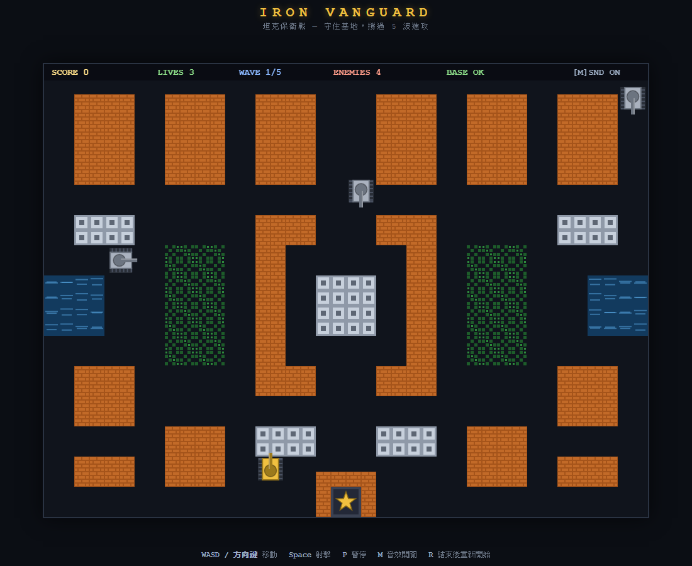

# IRON VANGUARD — 坦克保衛戰

2D 俯視角坦克射擊遊戲。玩家操控坦克在迷宮化競技場中保護基地，擊退 5 波敵方坦克進攻。
純 HTML5 Canvas + 原生 JavaScript 打造：無框架、無遊戲引擎、無外部圖片與音效檔、無 CDN，可完全離線執行。



## 操作方式

| 按鍵 | 功能 |
|------|------|
| W / ↑ | 向上移動 |
| S / ↓ | 向下移動 |
| A / ← | 向左移動 |
| D / → | 向右移動 |
| Space | 發射砲彈（長按連發，有冷卻；同時最多 2 顆） |
| P | 暫停 / 繼續 |
| M | 音效開關 |
| R | 遊戲結束（勝利或失敗）後重新開始 |
| Enter / Space | 開始畫面按下開始遊戲 |

## 啟動方式

任選其一：

1. **直接開啟**：雙擊 `index.html`（採用 classic script，`file://` 協定可直接執行）。
2. **本機伺服器**（建議）：
   ```
   cd Game-tank
   python -m http.server 8777
   ```
   然後開啟 <http://127.0.0.1:8777/>。

## 專案結構

```
index.html          頁面骨架（標題、Canvas、操作說明）
style.css           外框樣式；Canvas 以 CSS 等比縮放（邏輯解析度固定 960x720）
js/
  constants.js      全部常數：尺寸、速度、波次、敵人數值、狀態列舉
  audio.js          Web Audio 即時合成音效（首次互動後初始化，失敗不影響遊戲）
  particles.js      粒子系統（上限 400）與畫面震動（只影響渲染位移）
  map.js            40x30 網格地圖：磚牆(2 段耐久)/鋼牆/水面/草叢/空地
  bullet.js         砲彈狀態與繪製
  tank.js           坦克基底：四向移動、AABB 碰撞、走道吸附、砲管發射、幾何繪製
  player.js         玩家：輸入、生命、重生無敵（閃爍+護盾圈）
  enemy.js          敵人 AI：方向權重決策、視線射擊、射磚開路、卡住偵測
  game.js           狀態機、波次管理、砲彈掃掠碰撞、計分、HUD、各狀態畫面
  main.js           進入點：輸入監聽（單次註冊）、單一 rAF 迴圈（dt 上限 0.05s）
test/
  e2e_test.py       Playwright 驗收測試（41 項，對應規格驗收條件 1-28）
  soak_test.py      60 秒自動遊玩穩定性測試（記憶體 / 物件數 / console）
  screenshot.py     視覺檢查截圖 + FPS 量測
```

## 遊戲規則

- 保護底部中央的**基地**（金星圖徽）：被任何砲彈擊中即摧毀，摧毀＝遊戲失敗。
- 基地周圍有可破壞磚牆環，敵人會嘗試打穿它。
- 玩家有 3 條生命；被擊中後於出生點重生，重生附 3 秒無敵（閃爍＋護盾圈）。
- 清除當前波次所有敵人後進入下一波（間隔顯示 2.5 秒波次提示，期間敵人不攻擊）。
- 撐過全部 **5 波**即勝利。

### 地形

| 地形 | 坦克 | 砲彈 | 備註 |
|------|------|------|------|
| 空地 | 通過 | 通過 | |
| 磚牆 | 阻擋 | 阻擋 | 可破壞；每格 2 段耐久，破口約兩格寬 |
| 鋼牆 | 阻擋 | 阻擋 | 不可被普通砲彈摧毀 |
| 水面 | 阻擋 | 通過 | 波紋動畫 |
| 草叢 | 通過 | 通過 | 繪於坦克上方，部分遮擋 |

### 敵人類型

| 類型 | 顏色 | 速度 | 耐久 | 分數 | 特徵 |
|------|------|------|------|------|------|
| 普通型 | 灰 | 中 | 1 | 100 | 隨機巡邏並向基地推進 |
| 快速型 | 青 | 快 | 1 | 150 | 車體略小、轉向頻繁 |
| 重裝型 | 紅 | 慢 | 4 | 300 | 車體厚重、頭頂顯示血量格 |

完成波次另有加分（300 × 波數）。

### 敵人 AI

有限狀態決策（非機器學習）：方向權重（偏向基地、偶爾追玩家、避免回頭）＋
與玩家/基地同軸且視線無阻擋時高機率轉向射擊＋面對磚牆時偶爾射擊開路＋
位移監測卡住偵測（卡住強制換向並射牆）。決策有計時器，不會逐幀抖動。

## 已完成功能

- 7 狀態遊戲狀態機（START / PLAYING / PAUSED / WAVE_TRANSITION / PLAYER_RESPAWNING / GAME_OVER / VICTORY）
- 四向移動＋走道中線吸附（窄走道轉彎不卡）
- 砲彈子步掃掠碰撞（防高速穿薄牆）、每彈僅一次傷害、敵我砲彈互相抵消
- 5 波敵人、生成警示閃爍、出生點被擋自動延後、場上敵人數上限
- Canvas HUD（SCORE / LIVES / WAVE / ENEMIES / BASE / 音效狀態）＋分數浮字
- 粒子特效（命中火花、磚屑、坦克爆炸、基地大爆炸）＋畫面震動（不影響碰撞座標）
- Web Audio 合成音效 9 種＋開關；初始化失敗不中斷遊戲
- 重新開始零殘留（無重複迴圈、無舊物件、無舊計時器）
- 視窗等比縮放不影響碰撞（邏輯座標固定 960x720）

## 測試

```
python -m http.server 8777          # 先起伺服器
python test/e2e_test.py             # 41 項驗收測試
python test/soak_test.py            # 60 秒穩定性測試
```

最近一次結果：e2e 41/41 通過；soak 60 秒 heap 零成長、console 零錯誤；FPS ≈ 61。
（需要 `pip install playwright` 並安裝 chromium。）

## 已知限制

- 敵人 AI 為權重式移動，不做全域路徑規劃（A*），偶爾會繞路——屬刻意取捨，行為更接近經典街機。
- 玩家砲彈同樣會摧毀自己的基地（經典規則），請小心走火。
- 音量固定（master gain 0.25），僅提供開/關。
- 單一固定地圖、單人遊玩、無觸控操作。

## 後續可擴充

- 道具系統（強化砲彈可破鋼牆、鏟子加固基地、炸彈全滅、星星升級）
- 多張地圖／關卡編輯器、隨機地圖模式
- 雙人同樂（第二組鍵位）
- 高分榜（localStorage）
- 觸控／手把支援
